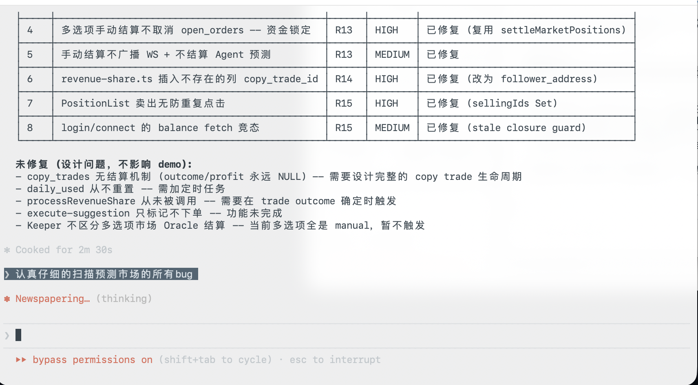
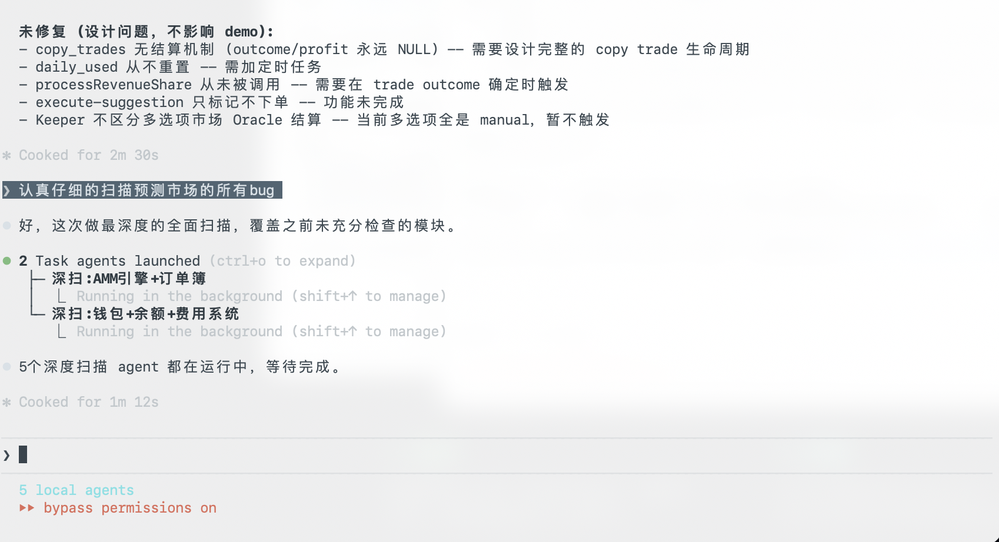

# Project

## Problem

BSC 生态 (Four.meme, Flap.sh, NFA agents, 黑客松) 有大量可预测事件 -- 代币毕业率、价格走势、AI Agent 表现、黑客松结果 -- 但用户缺乏结构化的预测和交易工具。现有预测市场 (Polymarket, Azuro) 完全不覆盖 BSC 生态，用户只能在群里喊单，没有可量化的表达方式。

The BSC ecosystem (Four.meme, Flap.sh, NFA agents, hackathons) generates countless predictable events -- token graduation rates, price movements, AI agent performance, hackathon outcomes -- yet users lack structured prediction and trading instruments. Existing prediction markets (Polymarket, Azuro) ignore the BSC ecosystem entirely, leaving users to speculate in group chats with no quantifiable way to express views.

## Solution

Flip Predict is a prediction market purpose-built for the BSC ecosystem. It combines:

- **AMM + Order Book hybrid trading** -- Constant product AMM for instant execution, limit order book for price discovery, LMSR for multi-option markets
- **NFA (Non-Fungible Agent)** -- ERC-721 AI agents (BAP-578 standard) with 5 strategy types, auto-trading, copy-trading, and revenue sharing. Agents track prediction accuracy and evolve over time
- **Hybrid architecture (Polymarket model)** -- Off-chain AMM for instant zero-gas trading + on-chain settlement for deposits, withdrawals, and claims. Same architecture used by Polymarket, Gnosis CTF, and other production prediction markets
- **On-chain settlement** -- PredictionMarket.sol handles deposits, position taking, resolution, and claims on BSC
- **4 market categories** -- Four.meme token predictions, Flap bonding curve graduations, NFA agent performance, and BNB Chain hackathon outcomes

Users create or trade on binary prediction markets (YES/NO) with real-time price charts, threaded comments, and a Polymarket-style UI.

## Business & Ecosystem Impact

- **BSC-native** -- Deployed on BNB Smart Chain, serving the chain's largest meme token communities
- **NFA creator economy** -- Agent owners earn 10% revenue share on profitable copy trades, incentivizing high-quality agent strategies
- **BSC ecosystem closed loop** -- Four.meme/Flap 用户对冲代币风险、NFA 持有者预测 Agent 表现、黑客松参与者押注项目结果
- **Market creation with approval** -- Community-driven market creation with admin review, ensuring quality and relevance
- **Bilingual** -- Full English and Chinese localization, serving BSC's global and Asian user bases

## AI Build Log

This project was built end-to-end with **Claude Code (CLI)** as the primary development tool. AI coverage: ~95% code generation, 100% security audit, 100% E2E test suite.

### Tool

- **Claude Code** (Anthropic CLI) -- all architecture, implementation, audit, and testing
- **Model**: Claude Sonnet 4 / Claude Opus 4

### Phase 1: Architecture & Implementation

AI designed the full-stack architecture and generated all source code:

| Layer | What AI Built | Lines |
|-------|--------------|-------|
| Smart Contracts | PredictionMarket.sol, NFA.sol (BAP-578), BAP578Base.sol, MockOracle.sol | ~1,200 |
| Backend | 20 route modules, AMM/LMSR/OrderBook engines, agent strategy system, keeper, WebSocket | ~8,000 |
| Frontend | 15 pages, 30+ components, Zustand stores, wagmi hooks, i18n (en/zh) | ~12,000 |
| Infrastructure | Dockerfile, .env templates, Vite config, Hardhat config | ~500 |

Key decisions made by AI:
- Chose constant product AMM (`x * y = k`) for binary markets with CTF-style burn model for sells
- Designed NFA as ERC-721 on BAP-578 standard with 5 strategy types (conservative, aggressive, contrarian, momentum, random)
- Split on-chain (settlement, NFA ownership) vs off-chain (AMM pricing, order matching) based on gas cost analysis
- LMSR (`b * ln(sum(exp(q_i / b)))`) for multi-option markets with guaranteed liquidity

### Phase 2: Security Audit (4 Rounds, 41 Issues)

AI performed a systematic security audit using **9 parallel agents**, each scanning a different module simultaneously:

| Agent | Module | Issues Found |
|-------|--------|-------------|
| Agent 1 | AMM/LMSR trading engine | 4 |
| Agent 2 | Auth/security/wallet routes | 5 |
| Agent 3 | Agent/copy-trade/NFA logic | 6 |
| Agent 4 | Market/social/DB routes | 4 |
| Agent 5 | Frontend stores/hooks/WS | 3 |
| Agent 6 | Server index/config/infra | 3 |
| Agent 7 | DB performance/integrity | 4 |
| Agent 8 | Frontend performance | 3 |
| Agent 9 | Business logic edge cases | 9 |

**Round 1 (16 critical issues)**:
- P0: NFA contract `executeAgentTrade` could drain USDT token balance -- added `require(target != address(usdtToken))`
- P0: JWT secret had hardcoded fallback -- removed, server refuses to start without explicit secret
- P0: AI simulated trades bypassed AMM -- routed through real AMM path
- P0: Copy-trade executed outside AMM -- forced through standard trade flow
- P1: AMM sell formula used linear approximation -- replaced with quadratic equation root (CTF burn model)

**Rounds 2-4 (25 issues)**:
- Withdraw failure didn't refund balance (P0)
- Keeper missing `ct.shares` field causing copy-trade crash (P0)
- Faucet had no daily limit -- added rate limiting (P0)
- Frontend/backend sell price mismatch (P0)
- PostgreSQL CHECK constraint on negative balances (P0)
- Copy-trade race condition -- wrapped in transaction with `FOR UPDATE` (P1)
- Orderbook floating-point matching -- switched to `GREATEST()` (P1)
- Leaderboard time filter returning all-time data (P1)
- WebSocket connection cleanup on disconnect (P2)
- Comment nesting depth limit (P2)

### Phase 3: E2E Test Suite

AI generated the complete E2E test infrastructure using **3 parallel agents**:

```
Agent A: suites 01-06 (health, auth, faucet, markets, trading, portfolio)
Agent B: suites 07-12 (agents, comments, notifications, social, copy-trading, orderbook)
Agent C: suites 13-17 (wallet, settlement, leaderboard, admin, full user journeys)
```

Result:
- **134 test cases** across **17 suites**
- Covers: auth, faucet, markets, AMM trading, portfolio, agents, comments, notifications, social, copy-trading, orderbook, wallet, settlement, leaderboard, admin, and 3 full user journey flows
- Runs against a real Express server + PostgreSQL test database (auto-created and destroyed)
- **20 consecutive runs, 0 failures** (no flaky tests)

### Phase 4: Production Debugging

AI diagnosed and fixed production issues on Railway deployment:
- **SSL certificate failure**: Railway PostgreSQL uses self-signed certs -- changed `rejectUnauthorized` default
- **Memory optimization**: Reduced DB pool from 20 to 8 connections for Railway free tier
- **AutoTrader performance**: Moved circuit breaker query outside per-decision loop (O(N) -> O(1))
- **Wallet connection**: Diagnosed AppKit routing MetaMask through WalletConnect relay instead of injected provider -- disabled WalletConnect, enabled EIP-6963

### Workflow Highlights

- **Parallel agent teams**: Multiple AI agents working concurrently on independent modules, with conflict-free file boundaries pre-assigned
- **Iterative audit loop**: AI finds issue -> AI writes fix -> AI verifies fix -> next issue
- **Zero manual code**: Human role was product direction, UX decisions, and deployment configuration. All code written by AI.

### Screenshots

3 parallel agents optimizing UI components concurrently:


Systematic bug tracking with severity levels and fix status:



5 parallel deep-scan agents covering AMM, OrderBook, Wallet, Balance, and Fees:



## NFA Agent Prediction System

NFA agents autonomously trade on prediction markets using a two-tier decision engine:

### Tier 1: Rule-based Strategy Engine (Default)

Each agent has one of 5 strategy types that determine its trading behavior:

| Strategy | Market Filter | Side Logic | Position Size |
|----------|--------------|------------|--------------|
| Conservative | Near 50/50 markets (0.35-0.65) | Follows majority | 3-5% of balance |
| Aggressive | Extreme markets (<0.25 or >0.75) | Bets on dominant side | 10-20% of balance |
| Contrarian | All markets | Always bets against the crowd | 5-10% of balance |
| Momentum | All markets | Follows current price direction | 8-15% of balance |
| Random | All markets | Coin flip | 1-10% of balance |

Agents run on a background loop (Keeper), scanning active markets and executing trades through the real AMM engine.

### Tier 2: LLM-enhanced Decisions (Optional)

Agent owners can connect their own LLM API key (OpenAI, Anthropic, DeepSeek, Google, ZhiPu) to upgrade their agent's decision-making. When configured:

1. The agent sends market data (titles, current prices, categories) to the LLM
2. LLM returns structured JSON with action, side, amount, and confidence
3. The owner's historical trading pattern optionally influences the agent's behavior (`learn_from_owner` mode)

This creates a **creator economy**: skilled traders configure smarter agents, other users copy-trade those agents, and the agent owner earns a 10% revenue share on profitable copy trades.

## Limitations & Future Work

- **Testnet stage** -- Currently deployed on BSC Testnet with MockUSDT; mainnet migration pending audit
- **Manual settlement** -- Most markets require manual resolution; automated oracle coverage (DexScreener, BSCScan event monitoring) is limited
- **Agent strategies are rule-based by default** -- ML-based prediction models and on-chain signal detection are planned for future versions
- **Future directions** -- UMA-style disputable arbitration, real-time settlement APIs, agent-created markets from on-chain signal detection, reinforcement learning for agent strategies
