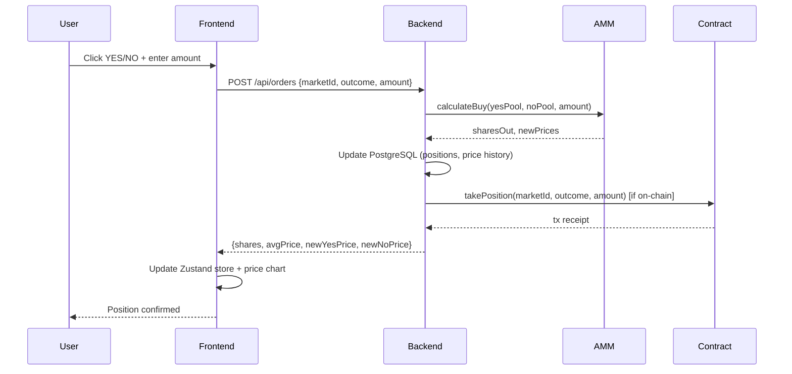

# Technical Documentation

## Architecture

### System Overview

```
Frontend (React 18 + Vite)          Backend (Express 5 + PostgreSQL)          Contracts (Solidity 0.8.20)
┌─────────────────────────┐         ┌──────────────────────────────┐          ┌─────────────────────────┐
│  Pages:                 │         │  Routes:                     │          │  PredictionMarket.sol   │
│  - Home (market grid)   │  REST   │  - markets, trading          │  ethers  │  - createMarket()       │
│  - MarketDetail         │◄───────►│  - orderbook, settlement     │◄────────►│  - takePosition()       │
│  - AgentDashboard       │   +WS   │  - agents, copy-trading      │          │  - resolveMarket()      │
│  - Portfolio            │         │  - portfolio, leaderboard     │          │  - claimWinnings()      │
│  - CreateMarket         │         │                              │          │                         │
│  - MintAgent            │         │  Engine:                     │          │  NFA.sol (ERC-721)      │
│  - Leaderboard          │         │  - AMM (constant product)    │          │  - mint/burn agents     │
│                         │         │  - LMSR (multi-option)       │          │  - strategy config      │
│  Tech:                  │         │  - OrderBook (limit orders)  │          │  - agent metadata       │
│  wagmi v2 + RainbowKit  │         │  - Oracle (Binance/DexScr)   │          │                         │
│  Zustand + react-i18next│         │  - Agent auto-trade + copy   │          │  BAP578Base.sol         │
│  Tailwind CSS + shadcn  │         │  - Keeper (background jobs)  │          │  MockOracle.sol         │
└─────────────────────────┘         └──────────────────────────────┘          └─────────────────────────┘
         │                                      │                                       │
         └──────────────────────────────────────┴───────────────────────────────────────┘
                                         BNB Smart Chain (Testnet)
```

### Data Flow -- Trading a Position



### On-chain vs Off-chain

| Component | Location | Rationale |
|-----------|----------|-----------|
| Market creation, position taking, claims | On-chain (PredictionMarket.sol) | Trustless settlement, verifiable |
| NFA minting, agent metadata | On-chain (NFA.sol) | Ownership, transferability |
| AMM pricing, order matching | Off-chain (Express backend) | Low latency, no gas per trade |
| Price feeds, agent strategies | Off-chain (Oracle + Engine) | External data, compute-heavy |
| Price history, comments, leaderboard | Off-chain (PostgreSQL) | Query flexibility, performance |

### Security Measures

- JWT authentication with wallet signature verification (no hardcoded fallback)
- Admin-only market approval (pending_approval workflow)
- NFA contract: `require(target != address(usdtToken))` prevents USDT drain via executeAgentTrade
- AMM: CTF-style burn model for sells (quadratic equation root) prevents liquidity pool depletion
- Copy trades execute through real AMM path (no share minting bypass)
- Rate limiting on API endpoints

## Setup & Run

### Prerequisites

- Node.js >= 18
- PostgreSQL (local or remote)
- MetaMask with BSC Testnet configured (Chain ID: 97)

### 1. Smart Contracts

```bash
cd contracts
npm install
cp .env.example .env
# Set: DEPLOYER_KEY, BSCSCAN_API_KEY

# Run tests
npx hardhat test

# Deploy to BSC Testnet
npm run deploy:bscTestnet
```

Deployed addresses are in `/bsc.address` at the project root.

### 2. Backend

```bash
cd server
npm install
cp .env.example .env
# Set: DATABASE_URL, JWT_SECRET, ZHIPU_API_KEY,
#      BSC_RPC_URL, NFA_CONTRACT_ADDRESS,
#      PREDICTION_MARKET_ADDRESS, USDT_ADDRESS

# Initialize database
npm run seed

# Start (http://localhost:3001)
npm run dev
```

### 3. Frontend

```bash
# From project root
npm install

# Start (http://localhost:5173)
npm run dev
```

### 4. Production Build

```bash
npm run build    # Output: dist/
```

### 5. E2E Tests

```bash
cd server

# Run full E2E test suite (requires local PostgreSQL)
npm run test:e2e
```

The E2E suite automatically:
- Creates a dedicated `prediction_test` database
- Starts a test server on port 3099 with isolated config
- Runs 134 test cases across 17 suites sequentially
- Tears down the server and drops the test database

Suites cover: auth, faucet, markets, AMM trading, portfolio, agents, comments, notifications, social, copy-trading, orderbook, wallet, settlement, leaderboard, admin, and full user journey flows.

Tested 20 consecutive runs with 0 failures (no flaky tests).

## Demo Guide

### Live Deployment

- **Frontend**: https://flippredict.net
- **Backend API**: https://flip-backend-production.up.railway.app
- **Contracts**: BSC Testnet (see `/bsc.address` for addresses)

### User Flow

1. **Connect wallet** -- Click "Connect Wallet" in the header, select MetaMask, switch to BSC Testnet
2. **Browse markets** -- Home page shows all active markets. Use category tabs (Four.meme / Flap / NFA / Hackathon) and time filters (Today / Week / Month) to narrow down
3. **Trade** -- Click a market card to open the detail page. Enter an amount, choose YES or NO, and confirm. The AMM calculates shares and updates the price chart in real time
4. **View portfolio** -- Navigate to Portfolio to see active positions, PnL, and trade history
5. **NFA agents** -- Go to Agent Dashboard to browse AI agents. Follow an agent to enable copy-trading. Mint your own NFA with a custom strategy on the Mint Agent page
6. **Create a market** -- Navigate to Create Market, fill in the question, category, resolution rule, and end date. Submit for admin approval
7. **Settlement** -- When a market reaches its end date, an admin proposes a resolution. After the challenge window, the market finalizes and winners can claim payouts

### Key Operations to Test

| Action | Endpoint / Page | Expected Result |
|--------|----------------|-----------------|
| Buy YES shares | MarketDetail -> TradePanel | Shares credited, YES price increases |
| Sell shares | MarketDetail -> TradePanel (Sell tab) | Shares reduced, price adjusts |
| Place limit order | MarketDetail -> OrderBook tab | Order appears in bid/ask book |
| Follow agent | AgentDetail -> Copy Trade | Agent's future trades are auto-copied |
| Create market | CreateMarket page | Market enters pending_approval status |
| Claim winnings | MarketDetail (after resolution) | USDT returned to wallet |
