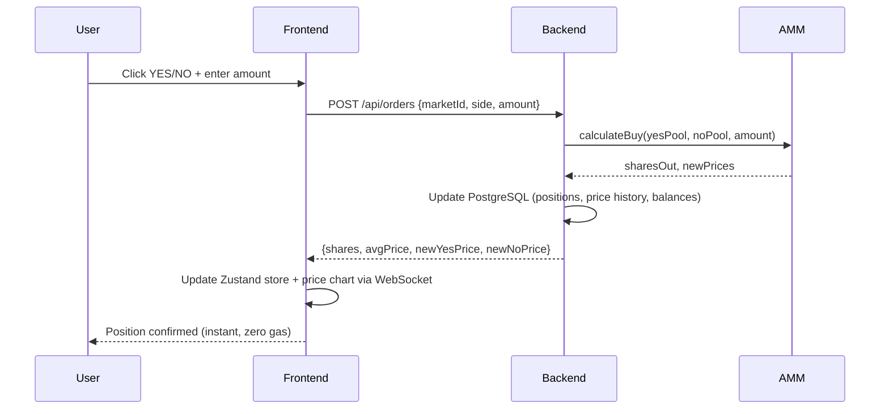
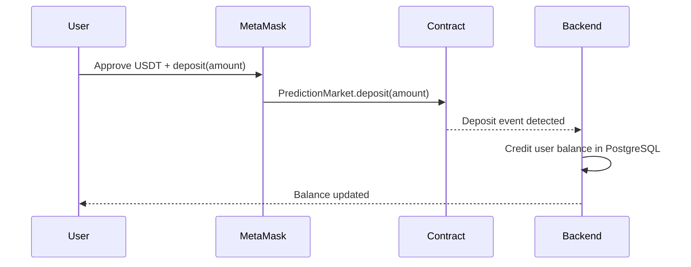

# Technical Documentation

## Architecture

### System Overview

```
Frontend (React 18 + Vite)          Backend (Express 5 + PostgreSQL)          Contracts (Solidity 0.8.20)
┌─────────────────────────┐         ┌──────────────────────────────┐          ┌─────────────────────────┐
│  Pages:                 │         │  Routes:                     │          │  PredictionMarket.sol   │
│  - Home (market grid)   │  REST   │  - markets, trading          │  ethers  │  - createMarket()       │
│  - MarketDetail         │◄───────►│  - orderbook, settlement     │◄────────►│  - takePosition()       │
│  - AgentDashboard       │   +WS   │  - agents, copy-trading      │          │  - resolveMarket()      │
│  - Portfolio            │         │  - portfolio, leaderboard     │          │  - claimWinnings()      │
│  - CreateMarket         │         │                              │          │                         │
│  - MintAgent            │         │  Engine:                     │          │  NFA.sol (ERC-721)      │
│  - Leaderboard          │         │  - AMM (constant product)    │          │  - mint/burn agents     │
│                         │         │  - LMSR (multi-option)       │          │  - strategy config      │
│  Tech:                  │         │  - OrderBook (limit orders)  │          │  - agent metadata       │
│  wagmi v2 + viem        │         │  - Oracle (Binance/DexScr)   │          │                         │
│  Zustand + react-i18next│         │  - Agent auto-trade + copy   │          │  BAP578Base.sol         │
│  Tailwind CSS + shadcn  │         │  - Keeper (background jobs)  │          │  MockOracle.sol         │
└─────────────────────────┘         └──────────────────────────────┘          └─────────────────────────┘
         │                                      │                                       │
         └──────────────────────────────────────┴───────────────────────────────────────┘
                                         BNB Smart Chain (Testnet)
```

### Data Flow -- Trading a Position



### Data Flow -- Deposit / Withdraw (On-chain)



### Hybrid Architecture: Off-chain Matching + On-chain Settlement

Flip Predict uses the same architecture as **Polymarket** and **Gnosis CTF**: fast off-chain order matching with trustless on-chain settlement. This is the industry-standard design for prediction markets -- putting every trade on-chain would cost ~$0.50 gas per trade on BSC and add 3-5 second latency, making the UX unusable for active traders.

**What happens on-chain (verifiable on BscScan):**

| Action | Contract Function | When |
|--------|------------------|------|
| Deposit USDT | `PredictionMarket.deposit()` | User funds their account |
| Withdraw USDT | `PredictionMarket.adminWithdraw()` | User withdraws profits |
| Mint NFA Agent | `NFA.mint()` | User creates an AI agent (ERC-721) |
| Resolve market | `PredictionMarket.resolveMarket()` | Admin settles outcome |
| Claim winnings | `PredictionMarket.claimWinnings()` | Winner redeems payout |
| Split/Merge CTF | `PredictionMarket.splitPosition()` | CTF token operations |

**What happens off-chain (low latency, zero gas):**

| Action | Engine | Rationale |
|--------|--------|-----------|
| Buy/Sell YES/NO shares | Constant product AMM (`x * y = k`) | Instant execution, no gas |
| Limit orders | OrderBook engine | Price discovery |
| Multi-option markets | LMSR (`b * ln(sum(exp(q_i / b)))`) | Guaranteed liquidity |
| Agent auto-trading | Strategy engine + optional LLM | Compute-heavy decisions |
| Price history, comments | PostgreSQL | Query flexibility |

This hybrid model gives users the best of both worlds: **instant trading** (off-chain AMM) with **trustless settlement** (on-chain contracts). All USDT flows (deposit, withdraw, winnings) are fully verifiable on BSC.

### Security Measures

- JWT authentication with wallet signature verification (no hardcoded fallback)
- Admin-only market approval (pending_approval workflow)
- NFA contract: `require(target != address(usdtToken))` prevents USDT drain via executeAgentTrade
- AMM: CTF-style burn model for sells (quadratic equation root) prevents liquidity pool depletion
- Copy trades execute through real AMM path (no share minting bypass)
- Rate limiting on API endpoints
- 4-round security audit: 41 issues found and fixed

## Reproduction Guide

### Prerequisites

- Node.js >= 18
- PostgreSQL running locally (default: `localhost:5432`, user `postgres`)
- MetaMask browser extension with BSC Testnet (Chain ID: 97)

### Step 1: Clone the Repository

```bash
git clone https://github.com/saiboyizhan/flip-predict.git
cd flip-predict
```

### Step 2: Smart Contracts (Optional -- already deployed)

Contracts are already deployed on BSC Testnet. See `/bsc.address` for addresses. To redeploy:

```bash
cd contracts
npm install
cp .env.example .env
# Edit .env: set DEPLOYER_KEY (private key without 0x) and BSCSCAN_API_KEY

npx hardhat test                 # Run contract tests
npm run deploy:bscTestnet        # Deploy to BSC Testnet
```

### Step 3: Backend

```bash
cd server
npm install
cp .env.example .env
```

Edit `server/.env` with minimum required values:

```env
PORT=3001
JWT_SECRET=any-random-string-here
PG_HOST=localhost
PG_PORT=5432
PG_USER=postgres
PG_PASSWORD=postgres
PG_DB=prediction
BSC_NETWORK=testnet
```

Then initialize the database and start the server:

```bash
npm run seed                     # Create tables + seed 24 markets
npm run dev                      # Start server at http://localhost:3001
```

### Step 4: Frontend

```bash
# From project root (flip-predict/)
npm install
cp .env.example .env
```

Edit `.env`:

```env
VITE_API_URL=http://localhost:3001
VITE_WS_URL=ws://localhost:3001
VITE_PREDICTION_MARKET_ADDRESS=0x1c2702Ce1A66Ca1225f85AFC75925795e8DA58Da
VITE_NFA_CONTRACT_ADDRESS=0x1a303032E49b7A0C395C938d73ff09cecE295081
VITE_USDT_ADDRESS=0x21fC50C7D2d174EF6d4c9B07Ba36Bfc4cD45233F
```

Start the development server:

```bash
npm run dev                      # Start at http://localhost:5173
```

### Step 5: E2E Tests (Optional)

```bash
cd server
npm run test:e2e
```

The E2E suite automatically:
- Creates a dedicated `prediction_test` database
- Starts a test server on port 3099
- Runs 134 test cases across 17 suites
- Tears down the test database after completion

Tested 20 consecutive runs with 0 failures.

### Step 6: Production Build

```bash
# From project root
npm run build                    # Output: dist/
```

## Live Deployment

| Component | URL |
|-----------|-----|
| Frontend | https://flippredict.net |
| Backend API | https://flip-backend-production.up.railway.app |
| Contracts | BSC Testnet (see `/bsc.address`) |

Frontend hosted on Cloudflare Pages. Backend hosted on Railway with PostgreSQL.

## Demo Walkthrough

1. **Connect wallet** -- Open https://flippredict.net, click "Connect Wallet", select MetaMask, ensure BSC Testnet is active
2. **Sign in** -- After connecting, click "Sign In" to authenticate via signature
3. **Browse markets** -- Home page shows 24 active markets across 4 categories (Four.meme / Flap / NFA / Hackathon). Use time filters (Today / Week / Month) to narrow down
4. **Trade** -- Click any market to open the detail page. Enter an amount, choose YES or NO, confirm. The AMM calculates shares and updates prices in real time
5. **Portfolio** -- Navigate to Portfolio to see active positions, PnL, and trade history
6. **NFA agents** -- Go to Agent Dashboard to browse AI agents. Follow an agent for copy-trading. Mint your own NFA with a custom strategy
7. **Create a market** -- Navigate to Create Market, fill in question, category, resolution rule, and end date. Submit for admin approval
8. **Settlement** -- Admin settles resolved markets. Winners claim payouts

### Key Operations

| Action | Where | Expected Result |
|--------|-------|-----------------|
| Buy YES shares | MarketDetail -> TradePanel | Shares credited, YES price increases |
| Sell shares | MarketDetail -> TradePanel (Sell tab) | Shares reduced, price adjusts |
| Place limit order | MarketDetail -> OrderBook tab | Order appears in bid/ask book |
| Follow agent | AgentDetail -> Copy Trade | Agent's future trades are auto-copied |
| Create market | CreateMarket page | Market enters pending_approval status |
| Claim winnings | MarketDetail (after resolution) | USDT returned to balance |
